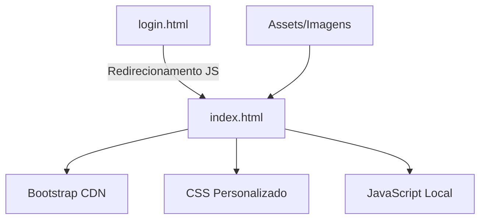
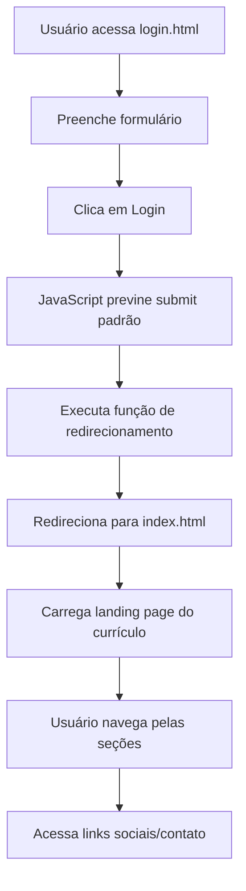
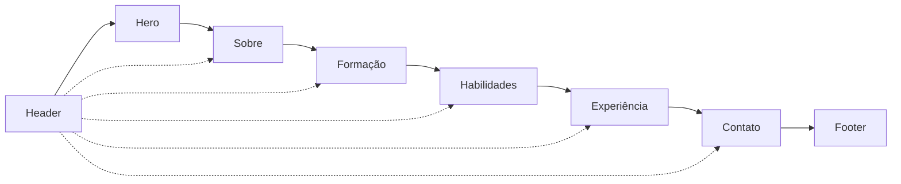

# Documento de Design Técnico - Atividade Prática Bootstrap

## Visão Geral

Este documento detalha o design técnico para uma aplicação web responsiva desenvolvida com Bootstrap 5, consistindo em uma tela de login simples e uma landing page que funciona como currículo online. O sistema demonstra competências em desenvolvimento front-end responsivo para fins acadêmicos.

### Objetivos do Design

- Criar uma interface responsiva utilizando Bootstrap 5
- Implementar navegação simples entre tela de login e currículo
- Demonstrar uso adequado do sistema de grid e componentes Bootstrap
- Garantir compatibilidade cross-browser e performance otimizada
- Manter código limpo e estrutura de arquivos organizada

## Arquitetura

### Arquitetura Geral

O sistema segue uma arquitetura client-side simples baseada em páginas estáticas HTML com estilização Bootstrap e funcionalidades JavaScript básicas.



### Estrutura de Arquivos

```
projeto-bootstrap/
├── login.html              # Página de login
├── index.html              # Landing page (currículo)
├── css/
│   └── styles.css          # Estilos personalizados
├── js/
│   └── script.js           # Scripts JavaScript
└── assets/
    └── imagens/            # Recursos visuais
```

### Tecnologias Utilizadas

- **Bootstrap 5.3.x**: Framework CSS principal via CDN
- **HTML5**: Estrutura semântica das páginas
- **CSS3**: Estilos personalizados complementares
- **JavaScript ES6**: Funcionalidades de redirecionamento e interação
- **Font Awesome**: Ícones para redes sociais (opcional via CDN)

## Componentes e Interfaces

### Página de Login (login.html)

#### Estrutura HTML
```html
<!DOCTYPE html>
<html lang="pt-BR">
<head>
    <meta charset="UTF-8">
    <meta name="viewport" content="width=device-width, initial-scale=1.0">
    <title>Login - Currículo Walter Baraúna</title>
    <link href="https://cdn.jsdelivr.net/npm/bootstrap@5.3.0/dist/css/bootstrap.min.css" rel="stylesheet">
    <link rel="stylesheet" href="css/styles.css">
</head>
<body>
    <!-- Conteúdo da página -->
</body>
</html>
```

#### Componentes Bootstrap Utilizados
- **Container**: `container-fluid` para layout responsivo
- **Card**: Componente principal para o formulário de login
- **Form**: Formulário com validação visual Bootstrap
- **Button**: Botão primário estilizado
- **Input Group**: Agrupamento de campos de entrada

#### Layout Responsivo
- **Desktop (≥992px)**: Card centralizado com largura máxima de 400px
- **Tablet (768px-991px)**: Card com margem lateral reduzida
- **Mobile (<768px)**: Card ocupando 95% da largura da tela

### Landing Page (index.html)

#### Estrutura de Seções
1. **Header**: Navegação e informações de contato
2. **Hero Section**: Apresentação pessoal e objetivo profissional
3. **Sobre**: Informações pessoais detalhadas
4. **Formação**: Educação acadêmica
5. **Habilidades**: Competências técnicas
6. **Experiência**: Histórico profissional
7. **Contato**: Links sociais e informações de contato
8. **Footer**: Informações adicionais

#### Componentes Bootstrap por Seção

**Header/Navbar**
- `navbar`: Barra de navegação responsiva
- `navbar-brand`: Logo/nome
- `navbar-toggler`: Menu hambúrguer para mobile

**Hero Section**
- `jumbotron` (customizado): Seção de destaque
- `display-*`: Classes de tipografia para títulos
- `lead`: Texto de introdução

**Seções de Conteúdo**
- `container`: Contêiner principal
- `row` e `col-*`: Sistema de grid responsivo
- `card`: Cards para organizar informações
- `list-group`: Listas de habilidades e experiências
- `badge`: Tags para tecnologias

**Contato/Footer**
- `btn`: Botões para links sociais
- `text-center`: Centralização de conteúdo

### Sistema de Grid Responsivo

#### Breakpoints Utilizados
- **xs** (<576px): Layout em coluna única
- **sm** (≥576px): Início de layout em duas colunas
- **md** (≥768px): Layout padrão em duas colunas
- **lg** (≥992px): Layout expandido em três colunas
- **xl** (≥1200px): Layout completo com espaçamento otimizado

#### Configuração de Colunas por Seção
```css
/* Exemplo de configuração responsiva */
.secao-habilidades {
    /* Mobile: 1 coluna */
    col-12
    /* Tablet: 2 colunas */
    col-md-6
    /* Desktop: 3 colunas */
    col-lg-4
}
```

## Modelos de Dados

### Estrutura de Dados do Currículo

```javascript
const curriculoData = {
    informacoesPessoais: {
        nome: "Walter Gonçalves Baraúna Filho",
        telefone: "(85) 99999-9999",
        email: "walter.barauna@gmail.com",
        linkedin: "linkedin.com/in/walter-barauna",
        instagram: "@walter.barauna"
    },
    objetivo: "Desenvolvedor em busca de oportunidades...",
    formacao: [
        {
            curso: "Técnico em Informática",
            instituicao: "EEEP Manoel Mano",
            periodo: "2019-2021"
        },
        {
            curso: "Sistemas de Informação",
            instituicao: "Universidade",
            periodo: "2022-presente"
        }
    ],
    habilidades: [
        "Git/Github", "Python", "Django", 
        "SQL", "PostgreSQL", "AWS", "APIs"
    ],
    experiencia: [
        {
            cargo: "Desenvolvedor",
            empresa: "Suprelogic Tecnologia",
            periodo: "2022-presente",
            descricao: "Desenvolvimento de soluções..."
        }
    ]
};
```

### Configuração de Formulário de Login

```javascript
const loginConfig = {
    campos: {
        usuario: {
            tipo: "text",
            obrigatorio: true,
            placeholder: "Digite seu usuário"
        },
        senha: {
            tipo: "password",
            obrigatorio: true,
            placeholder: "Digite sua senha"
        }
    },
    redirecionamento: {
        destino: "index.html",
        delay: 500 // ms
    }
};
```

## Design Responsivo e Breakpoints

### Estratégia Mobile-First

O design segue a abordagem mobile-first do Bootstrap, começando com estilos para dispositivos móveis e expandindo para telas maiores.

#### Configurações por Breakpoint

**Extra Small (xs) - <576px**
- Layout em coluna única
- Navegação colapsada
- Cards com largura total
- Texto centralizado
- Botões em largura total

**Small (sm) - ≥576px**
- Início de layout em duas colunas para algumas seções
- Navegação ainda colapsada
- Cards com margem lateral

**Medium (md) - ≥768px**
- Layout padrão em duas colunas
- Navegação expandida
- Cards organizados em grid 2x2
- Espaçamento otimizado

**Large (lg) - ≥992px**
- Layout em três colunas para seções apropriadas
- Navegação completa
- Cards em grid 3x3
- Sidebar para informações de contato

**Extra Large (xl) - ≥1200px**
- Layout completo com máximo aproveitamento do espaço
- Containers com largura máxima definida
- Espaçamento generoso entre elementos

### Classes Utilitárias Responsivas

```css
/* Exemplos de classes utilizadas */
.d-none.d-md-block          /* Oculto em mobile, visível em tablet+ */
.col-12.col-md-6.col-lg-4   /* Responsivo em grid */
.text-center.text-md-start  /* Centralizado em mobile, alinhado à esquerda em tablet+ */
.mb-3.mb-md-4.mb-lg-5       /* Margem bottom responsiva */
```

## Fluxo de Navegação

### Fluxo Principal



### Navegação Interna (Landing Page)



### Funcionalidades de Redirecionamento

#### Login para Index
```javascript
function handleLogin(event) {
    event.preventDefault();
    
    // Feedback visual
    const button = event.target.querySelector('button[type="submit"]');
    button.innerHTML = '<span class="spinner-border spinner-border-sm" role="status"></span> Entrando...';
    button.disabled = true;
    
    // Simula processamento
    setTimeout(() => {
        window.location.href = 'index.html';
    }, 500);
}
```

#### Links Externos
```javascript
// Abrir links sociais em nova aba
document.querySelectorAll('.link-externo').forEach(link => {
    link.addEventListener('click', (e) => {
        e.preventDefault();
        window.open(link.href, '_blank', 'noopener,noreferrer');
    });
});
```

## Organização de Arquivos

### Estrutura CSS

#### styles.css - Organização
```css
/* ===== VARIÁVEIS CSS ===== */
:root {
    --cor-primaria: #0d6efd;
    --cor-secundaria: #6c757d;
    --cor-sucesso: #198754;
    --fonte-principal: 'Segoe UI', Tahoma, Geneva, Verdana, sans-serif;
}

/* ===== ESTILOS GLOBAIS ===== */
body { }
.container { }

/* ===== PÁGINA DE LOGIN ===== */
.login-container { }
.login-card { }
.login-form { }

/* ===== LANDING PAGE ===== */
.hero-section { }
.secao-sobre { }
.secao-formacao { }
.secao-habilidades { }
.secao-experiencia { }
.secao-contato { }

/* ===== COMPONENTES REUTILIZÁVEIS ===== */
.card-personalizado { }
.botao-social { }
.badge-habilidade { }

/* ===== RESPONSIVIDADE PERSONALIZADA ===== */
@media (max-width: 767px) { }
@media (min-width: 768px) and (max-width: 991px) { }
@media (min-width: 992px) { }
```

### Estrutura JavaScript

#### script.js - Organização
```javascript
// ===== CONFIGURAÇÕES GLOBAIS =====
const CONFIG = {
    animacoes: true,
    tempoRedirecionamento: 500
};

// ===== FUNÇÕES DE LOGIN =====
function handleLogin(event) { }
function validarCampos() { }

// ===== FUNÇÕES DA LANDING PAGE =====
function inicializarAnimacoes() { }
function configurarLinksExternos() { }
function implementarScrollSuave() { }

// ===== INICIALIZAÇÃO =====
document.addEventListener('DOMContentLoaded', function() {
    // Inicializar funcionalidades baseadas na página atual
});
```

## Integração com CDN Bootstrap

### CDN Principal - Bootstrap 5.3.x

#### CSS Bootstrap
```html
<link href="https://cdn.jsdelivr.net/npm/bootstrap@5.3.0/dist/css/bootstrap.min.css" 
      rel="stylesheet" 
      integrity="sha384-9ndCyUa6c4iuQ+jJkbHq9bnUUqnJvzGADqzfs4Qg8JvXl5nv5v5v5v5v5v5v5v5v" 
      crossorigin="anonymous">
```

#### JavaScript Bootstrap
```html
<script src="https://cdn.jsdelivr.net/npm/bootstrap@5.3.0/dist/js/bootstrap.bundle.min.js" 
        integrity="sha384-geWF76RCwLtnZ8qwWowPQNguL3RmwHVBC9FhGdlKrxdiJJigb/j/68SIy3Te4Bkz" 
        crossorigin="anonymous"></script>
```

### CDN Secundário - Font Awesome (Opcional)

```html
<link rel="stylesheet" 
      href="https://cdnjs.cloudflare.com/ajax/libs/font-awesome/6.4.0/css/all.min.css"
      integrity="sha512-iecdLmaskl7CVkqkXNQ/ZH/XLlvWZOJyj7Yy7tcenmpD1ypASozpmT/E0iPtmFIB46ZmdtAc9eNBvH0H/ZpiBw=="
      crossorigin="anonymous" 
      referrerpolicy="no-referrer">
```

### Estratégia de Fallback

```html
<script>
// Verificar se Bootstrap carregou corretamente
if (typeof bootstrap === 'undefined') {
    console.warn('Bootstrap CDN falhou, carregando versão local...');
    // Implementar fallback se necessário
}
</script>
```

### Performance e Otimização

#### Preload de Recursos Críticos
```html
<link rel="preload" href="https://cdn.jsdelivr.net/npm/bootstrap@5.3.0/dist/css/bootstrap.min.css" as="style">
<link rel="preload" href="css/styles.css" as="style">
```

#### DNS Prefetch
```html
<link rel="dns-prefetch" href="//cdn.jsdelivr.net">
<link rel="dns-prefetch" href="//cdnjs.cloudflare.com">
```

## Propriedades de Correção

*Uma propriedade é uma característica ou comportamento que deve ser verdadeiro em todas as execuções válidas de um sistema - essencialmente, uma declaração formal sobre o que o sistema deve fazer. As propriedades servem como ponte entre especificações legíveis por humanos e garantias de correção verificáveis por máquina.*

### Propriedade 1: Redirecionamento Universal do Login

*Para qualquer* submissão do formulário de login, o sistema deve redirecionar para index.html independentemente das credenciais inseridas, executando função JavaScript e prevenindo o comportamento padrão de submit.

**Valida: Requisitos 1.3, 6.1, 6.2, 6.3**

### Propriedade 2: Responsividade Universal

*Para qualquer* elemento do sistema visualizado em diferentes tamanhos de tela, o layout deve se adaptar adequadamente: empilhando elementos verticalmente em telas pequenas (mobile) e organizando horizontalmente em telas grandes (desktop), mantendo legibilidade e usabilidade.

**Valida: Requisitos 1.4, 2.7, 2.8, 3.3, 3.4**

### Propriedade 3: Comportamento de Links Sociais

*Para qualquer* link social na landing page, quando clicado, o sistema deve abrir o destino em uma nova aba.

**Valida: Requisitos 4.4**

### Propriedade 4: Funcionamento sem Dependências Externas

*Para qualquer* execução do sistema, deve funcionar corretamente utilizando apenas Bootstrap CDN como dependência externa, sem requerer bibliotecas adicionais.

**Valida: Requisitos 5.6**

### Propriedade 5: Feedback Visual Durante Redirecionamento

*Para qualquer* processo de redirecionamento, o sistema deve fornecer feedback visual ao usuário indicando que a ação está sendo processada.

**Valida: Requisitos 6.4**

### Propriedade 6: Compatibilidade Cross-Browser

*Para qualquer* navegador moderno (Chrome, Firefox, Safari, Edge), o sistema deve funcionar corretamente mantendo todas as funcionalidades e aparência visual.

**Valida: Requisitos 7.2**

### Propriedade 7: Performance de Carregamento

*Para qualquer* acesso ao sistema em conexão padrão, o carregamento deve ser concluído em menos de 3 segundos.

**Valida: Requisitos 7.3**

### Propriedade 8: Validação HTML5

*Para qualquer* página do sistema, o código HTML deve validar sem erros críticos segundo os padrões HTML5.

**Valida: Requisitos 7.4**

### Propriedade 9: Graceful Degradation

*Para qualquer* acesso ao sistema com JavaScript desabilitado, todas as funcionalidades devem permanecer acessíveis exceto o redirecionamento automático do login.

**Valida: Requisitos 7.5**

## Tratamento de Erros

### Estratégias de Tratamento de Erros

#### Erros de Carregamento de CDN
```javascript
// Verificação de carregamento do Bootstrap
window.addEventListener('load', function() {
    if (typeof bootstrap === 'undefined') {
        console.error('Falha ao carregar Bootstrap CDN');
        // Implementar fallback ou notificação ao usuário
        showErrorMessage('Erro de carregamento. Tente recarregar a página.');
    }
});
```

#### Erros de JavaScript
```javascript
// Tratamento global de erros
window.addEventListener('error', function(e) {
    console.error('Erro JavaScript:', e.error);
    // Log do erro para debugging
    logError({
        message: e.message,
        filename: e.filename,
        lineno: e.lineno,
        colno: e.colno
    });
});
```

#### Erros de Formulário
```javascript
function handleLoginError(error) {
    const errorDiv = document.getElementById('login-error');
    errorDiv.innerHTML = `
        <div class="alert alert-warning alert-dismissible fade show" role="alert">
            Ocorreu um problema. Tente novamente.
            <button type="button" class="btn-close" data-bs-dismiss="alert"></button>
        </div>
    `;
    errorDiv.style.display = 'block';
}
```

### Validação de Entrada

#### Validação de Campos de Login
```javascript
function validarCamposLogin() {
    const usuario = document.getElementById('usuario').value.trim();
    const senha = document.getElementById('senha').value.trim();
    
    const erros = [];
    
    if (!usuario) {
        erros.push('Campo usuário é obrigatório');
    }
    
    if (!senha) {
        erros.push('Campo senha é obrigatório');
    }
    
    return {
        valido: erros.length === 0,
        erros: erros
    };
}
```

### Fallbacks e Degradação Graciosa

#### Fallback para CSS
```html
<noscript>
    <style>
        .js-only { display: none !important; }
        .no-js-show { display: block !important; }
    </style>
</noscript>
```

#### Fallback para Funcionalidades JavaScript
```html
<!-- Formulário funcional sem JavaScript -->
<form action="index.html" method="get" id="loginForm">
    <noscript>
        <p class="text-info">
            <small>JavaScript desabilitado. O formulário funcionará, mas sem validações dinâmicas.</small>
        </p>
    </noscript>
    <!-- Campos do formulário -->
</form>
```

## Estratégia de Validação

### Abordagem Simplificada para Projeto Acadêmico

Para este projeto acadêmico focado em demonstrar competências em Bootstrap, utilizaremos uma abordagem de validação simplificada e prática:

- **Validação manual**: Testes visuais em diferentes dispositivos e navegadores
- **Validação automática**: HTML5 e CSS3 via ferramentas online
- **Deploy automatizado**: GitHub Pages com CI/CD simples

### Validação Manual

#### Checklist de Testes Manuais
- **Funcionalidade de Login**: Testar redirecionamento em diferentes navegadores
- **Responsividade**: Usar DevTools para simular diferentes dispositivos
- **Links Sociais**: Verificar se abrem em nova aba
- **Navegação**: Testar scroll suave e navegação entre seções
- **Performance**: Verificar tempo de carregamento

#### Dispositivos de Teste
- **Mobile**: iPhone (375px), Android (360px)
- **Tablet**: iPad (768px), Android Tablet (800px)
- **Desktop**: Laptop (1366px), Desktop (1920px)

#### Navegadores de Teste
- Chrome (versão atual)
- Firefox (versão atual)
- Safari (se disponível)
- Edge (versão atual)

### Validação Automática

#### Ferramentas Online
- **HTML5**: https://validator.w3.org/
- **CSS3**: https://jigsaw.w3.org/css-validator/
- **Performance**: https://pagespeed.web.dev/
- **Acessibilidade**: https://wave.webaim.org/

### Deploy Automatizado - GitHub Pages

#### Configuração do GitHub Pages

**Estrutura do Repositório**
```
projeto-bootstrap/
├── .github/
│   └── workflows/
│       └── deploy.yml        # CI/CD para GitHub Pages
├── login.html                # Página de entrada
├── index.html                # Landing page principal
├── css/
│   └── styles.css
├── js/
│   └── script.js
├── assets/
│   └── imagens/
└── README.md
```

#### Pipeline de Deploy - GitHub Actions

**Arquivo: .github/workflows/deploy.yml**
```yaml
name: Deploy to GitHub Pages

on:
  push:
    branches: [ main ]
  pull_request:
    branches: [ main ]

jobs:
  deploy:
    runs-on: ubuntu-latest
    
    steps:
    - name: Checkout
      uses: actions/checkout@v4
    
    - name: Validate HTML
      run: |
        echo "Validando arquivos HTML..."
        # Verificar se arquivos existem
        test -f login.html || (echo "login.html não encontrado" && exit 1)
        test -f index.html || (echo "index.html não encontrado" && exit 1)
        echo "Arquivos HTML encontrados ✓"
    
    - name: Validate CSS
      run: |
        echo "Validando arquivos CSS..."
        test -f css/styles.css || (echo "css/styles.css não encontrado" && exit 1)
        echo "Arquivos CSS encontrados ✓"
    
    - name: Validate JavaScript
      run: |
        echo "Validando arquivos JavaScript..."
        test -f js/script.js || (echo "js/script.js não encontrado" && exit 1)
        echo "Arquivos JavaScript encontrados ✓"
    
    - name: Setup Pages
      uses: actions/configure-pages@v4
      
    - name: Upload artifact
      uses: actions/upload-pages-artifact@v3
      with:
        path: '.'
        
    - name: Deploy to GitHub Pages
      id: deployment
      uses: actions/deploy-pages@v4

# Configurar permissões para GitHub Pages
permissions:
  contents: read
  pages: write
  id-token: write

# Permitir apenas um deploy por vez
concurrency:
  group: "pages"
  cancel-in-progress: false
```

#### Configuração do Repositório GitHub

**Passos para Configurar GitHub Pages:**

1. **Criar Repositório**
   - Nome: `projeto-bootstrap` ou `curriculo-bootstrap`
   - Público (para GitHub Pages gratuito)

2. **Configurar GitHub Pages**
   - Ir em Settings → Pages
   - Source: GitHub Actions
   - Branch: main

3. **Adicionar Arquivos**
   - Fazer push dos arquivos HTML, CSS, JS
   - Incluir o workflow `.github/workflows/deploy.yml`

4. **Verificar Deploy**
   - URL será: `https://seu-usuario.github.io/projeto-bootstrap/`
   - Acessar via `login.html` como página inicial

#### Script de Deploy Local (Opcional)

**Arquivo: deploy.sh**
```bash
#!/bin/bash

echo "🚀 Iniciando deploy para GitHub Pages..."

# Verificar se estamos na branch main
BRANCH=$(git branch --show-current)
if [ "$BRANCH" != "main" ]; then
    echo "❌ Erro: Deploy deve ser feito na branch main"
    echo "Branch atual: $BRANCH"
    exit 1
fi

# Verificar se há mudanças não commitadas
if [ -n "$(git status --porcelain)" ]; then
    echo "❌ Erro: Há mudanças não commitadas"
    echo "Faça commit das mudanças antes do deploy"
    exit 1
fi

# Validar arquivos essenciais
echo "📋 Validando arquivos..."
FILES=("login.html" "index.html" "css/styles.css" "js/script.js")
for file in "${FILES[@]}"; do
    if [ ! -f "$file" ]; then
        echo "❌ Erro: Arquivo $file não encontrado"
        exit 1
    fi
done
echo "✅ Todos os arquivos encontrados"

# Push para GitHub
echo "📤 Fazendo push para GitHub..."
git push origin main

echo "✅ Deploy iniciado!"
echo "🌐 Site será disponível em: https://$(git config --get remote.origin.url | sed 's/.*github.com[:/]\([^/]*\)\/\([^.]*\).*/\1.github.io\/\2/')/"
echo "⏱️  Aguarde alguns minutos para o deploy ser concluído"
```

### Métricas de Qualidade Simplificadas

#### Performance
- Tempo de carregamento: < 3 segundos
- Tamanho total: < 2MB
- Imagens otimizadas: < 500KB cada

#### Acessibilidade Básica
- Contraste adequado (verificar visualmente)
- Navegação por teclado funcional
- Alt text em imagens
- Labels em formulários

#### Compatibilidade
- Funciona em Chrome, Firefox, Safari, Edge
- Responsivo em mobile, tablet, desktop
- Sem erros no console do navegador
## Especificações Técnicas para Implementação

### Requisitos Técnicos Mínimos

#### Navegadores Suportados
- **Chrome**: Versão 90+
- **Firefox**: Versão 88+
- **Safari**: Versão 14+
- **Edge**: Versão 90+

#### Dependências Externas
- **Bootstrap 5.3.x**: Framework CSS principal
- **Font Awesome 6.4.x**: Ícones (opcional)
- **CDN**: jsDelivr como provedor principal

#### Estrutura de Arquivos Obrigatória
```
projeto-bootstrap/
├── login.html                 # Página de entrada
├── index.html                 # Landing page principal
├── css/
│   └── styles.css             # Estilos personalizados
├── js/
│   └── script.js              # Funcionalidades JavaScript
└── assets/
    └── imagens/               # Recursos visuais
        ├── profile.jpg        # Foto de perfil (opcional)
        └── favicon.ico        # Ícone do site
```

### Implementação da Página de Login

#### Template HTML Base (login.html)
```html
<!DOCTYPE html>
<html lang="pt-BR">
<head>
    <meta charset="UTF-8">
    <meta name="viewport" content="width=device-width, initial-scale=1.0">
    <meta name="description" content="Login - Currículo Walter Baraúna">
    <title>Login - Currículo Walter Baraúna</title>
    
    <!-- Bootstrap CSS -->
    <link href="https://cdn.jsdelivr.net/npm/bootstrap@5.3.0/dist/css/bootstrap.min.css" rel="stylesheet">
    
    <!-- CSS Personalizado -->
    <link rel="stylesheet" href="css/styles.css">
    
    <!-- Favicon -->
    <link rel="icon" href="assets/imagens/favicon.ico" type="image/x-icon">
</head>
<body class="bg-light">
    <div class="container-fluid vh-100 d-flex align-items-center justify-content-center">
        <div class="row w-100">
            <div class="col-12 col-sm-8 col-md-6 col-lg-4 mx-auto">
                <div class="card shadow-sm">
                    <div class="card-body p-4">
                        <div class="text-center mb-4">
                            <h2 class="card-title">Acesso ao Currículo</h2>
                            <p class="text-muted">Walter Gonçalves Baraúna Filho</p>
                        </div>
                        
                        <form id="loginForm" novalidate>
                            <div class="mb-3">
                                <label for="usuario" class="form-label">Usuário</label>
                                <input type="text" class="form-control" id="usuario" name="usuario" 
                                       placeholder="Digite seu usuário" required>
                                <div class="invalid-feedback">
                                    Por favor, insira um usuário válido.
                                </div>
                            </div>
                            
                            <div class="mb-3">
                                <label for="senha" class="form-label">Senha</label>
                                <input type="password" class="form-control" id="senha" name="senha" 
                                       placeholder="Digite sua senha" required>
                                <div class="invalid-feedback">
                                    Por favor, insira uma senha.
                                </div>
                            </div>
                            
                            <div class="d-grid">
                                <button type="submit" class="btn btn-primary btn-lg">
                                    Entrar
                                </button>
                            </div>
                        </form>
                        
                        <div id="login-error" class="mt-3" style="display: none;"></div>
                        
                        <div class="text-center mt-4">
                            <small class="text-muted">
                                Sistema de demonstração acadêmica
                            </small>
                        </div>
                    </div>
                </div>
            </div>
        </div>
    </div>
    
    <!-- Bootstrap JS -->
    <script src="https://cdn.jsdelivr.net/npm/bootstrap@5.3.0/dist/js/bootstrap.bundle.min.js"></script>
    
    <!-- JavaScript Personalizado -->
    <script src="js/script.js"></script>
</body>
</html>
```

### Implementação da Landing Page

#### Template HTML Base (index.html)
```html
<!DOCTYPE html>
<html lang="pt-BR">
<head>
    <meta charset="UTF-8">
    <meta name="viewport" content="width=device-width, initial-scale=1.0">
    <meta name="description" content="Currículo Online - Walter Gonçalves Baraúna Filho">
    <title>Walter Baraúna - Desenvolvedor</title>
    
    <!-- Bootstrap CSS -->
    <link href="https://cdn.jsdelivr.net/npm/bootstrap@5.3.0/dist/css/bootstrap.min.css" rel="stylesheet">
    
    <!-- Font Awesome -->
    <link rel="stylesheet" href="https://cdnjs.cloudflare.com/ajax/libs/font-awesome/6.4.0/css/all.min.css">
    
    <!-- CSS Personalizado -->
    <link rel="stylesheet" href="css/styles.css">
    
    <!-- Favicon -->
    <link rel="icon" href="assets/imagens/favicon.ico" type="image/x-icon">
</head>
<body>
    <!-- Navegação -->
    <nav class="navbar navbar-expand-lg navbar-dark bg-primary fixed-top">
        <div class="container">
            <a class="navbar-brand" href="#home">Walter Baraúna</a>
            
            <button class="navbar-toggler" type="button" data-bs-toggle="collapse" 
                    data-bs-target="#navbarNav">
                <span class="navbar-toggler-icon"></span>
            </button>
            
            <div class="collapse navbar-collapse" id="navbarNav">
                <ul class="navbar-nav ms-auto">
                    <li class="nav-item">
                        <a class="nav-link" href="#sobre">Sobre</a>
                    </li>
                    <li class="nav-item">
                        <a class="nav-link" href="#formacao">Formação</a>
                    </li>
                    <li class="nav-item">
                        <a class="nav-link" href="#habilidades">Habilidades</a>
                    </li>
                    <li class="nav-item">
                        <a class="nav-link" href="#experiencia">Experiência</a>
                    </li>
                    <li class="nav-item">
                        <a class="nav-link" href="#contato">Contato</a>
                    </li>
                </ul>
            </div>
        </div>
    </nav>
    
    <!-- Hero Section -->
    <section id="home" class="hero-section bg-primary text-white py-5">
        <div class="container">
            <div class="row align-items-center min-vh-100">
                <div class="col-lg-6">
                    <h1 class="display-4 fw-bold mb-3">Walter Gonçalves Baraúna Filho</h1>
                    <p class="lead mb-4">Desenvolvedor em busca de oportunidades para aplicar conhecimentos em tecnologia e contribuir para projetos inovadores.</p>
                    <div class="d-flex gap-3">
                        <a href="#contato" class="btn btn-light btn-lg">Entre em Contato</a>
                        <a href="#sobre" class="btn btn-outline-light btn-lg">Saiba Mais</a>
                    </div>
                </div>
                <div class="col-lg-6 text-center">
                    
                </div>
            </div>
        </div>
    </section>
    
    <!-- Seção Sobre -->
    <section id="sobre" class="py-5">
        <div class="container">
            <div class="row">
                <div class="col-lg-8 mx-auto text-center">
                    <h2 class="mb-4">Sobre Mim</h2>
                    <p class="lead">
                        Desenvolvedor apaixonado por tecnologia, com formação técnica em Informática 
                        e cursando Sistemas de Informação. Experiência em desenvolvimento web com 
                        Python, Django e tecnologias modernas.
                    </p>
                </div>
            </div>
        </div>
    </section>
    
    <!-- Demais seções seguem estrutura similar -->
    
    <!-- Bootstrap JS -->
    <script src="https://cdn.jsdelivr.net/npm/bootstrap@5.3.0/dist/js/bootstrap.bundle.min.js"></script>
    
    <!-- JavaScript Personalizado -->
    <script src="js/script.js"></script>
</body>
</html>
```

### Implementação CSS Personalizada

#### Arquivo css/styles.css
```css
/* ===== VARIÁVEIS CSS ===== */
:root {
    --cor-primaria: #0d6efd;
    --cor-secundaria: #6c757d;
    --cor-sucesso: #198754;
    --cor-info: #0dcaf0;
    --cor-warning: #ffc107;
    --cor-danger: #dc3545;
    --fonte-principal: 'Segoe UI', Tahoma, Geneva, Verdana, sans-serif;
    --sombra-card: 0 0.125rem 0.25rem rgba(0, 0, 0, 0.075);
    --sombra-hover: 0 0.5rem 1rem rgba(0, 0, 0, 0.15);
}

/* ===== ESTILOS GLOBAIS ===== */
body {
    font-family: var(--fonte-principal);
    line-height: 1.6;
    scroll-behavior: smooth;
}

.min-vh-100 {
    min-height: 100vh;
}

/* ===== PÁGINA DE LOGIN ===== */
.login-container {
    background: linear-gradient(135deg, var(--cor-primaria), var(--cor-info));
}

.login-card {
    border: none;
    border-radius: 1rem;
    box-shadow: var(--sombra-hover);
}

.login-card:hover {
    transform: translateY(-2px);
    transition: all 0.3s ease;
}

/* ===== LANDING PAGE ===== */
.hero-section {
    background: linear-gradient(135deg, var(--cor-primaria), #0056b3);
    padding-top: 100px; /* Compensar navbar fixa */
}

.navbar-brand {
    font-weight: 700;
    font-size: 1.5rem;
}

.card-personalizado {
    border: none;
    border-radius: 0.75rem;
    box-shadow: var(--sombra-card);
    transition: all 0.3s ease;
}

.card-personalizado:hover {
    box-shadow: var(--sombra-hover);
    transform: translateY(-5px);
}

.badge-habilidade {
    font-size: 0.875rem;
    padding: 0.5rem 1rem;
    margin: 0.25rem;
    border-radius: 2rem;
}

.botao-social {
    width: 50px;
    height: 50px;
    border-radius: 50%;
    display: inline-flex;
    align-items: center;
    justify-content: center;
    margin: 0.5rem;
    transition: all 0.3s ease;
}

.botao-social:hover {
    transform: scale(1.1);
}

.botao-social.instagram {
    background: linear-gradient(45deg, #f09433, #e6683c, #dc2743, #cc2366, #bc1888);
}

.botao-social.linkedin {
    background-color: #0077b5;
}

.botao-social.email {
    background-color: #ea4335;
}

/* ===== ANIMAÇÕES ===== */
@keyframes fadeInUp {
    from {
        opacity: 0;
        transform: translateY(30px);
    }
    to {
        opacity: 1;
        transform: translateY(0);
    }
}

.fade-in-up {
    animation: fadeInUp 0.6s ease-out;
}

/* ===== RESPONSIVIDADE PERSONALIZADA ===== */
@media (max-width: 767px) {
    .hero-section {
        padding-top: 80px;
        text-align: center;
    }
    
    .display-4 {
        font-size: 2rem;
    }
    
    .btn-lg {
        padding: 0.75rem 1.5rem;
        font-size: 1rem;
    }
    
    .card-personalizado {
        margin-bottom: 1.5rem;
    }
}

@media (min-width: 768px) and (max-width: 991px) {
    .hero-section {
        padding-top: 90px;
    }
    
    .container {
        max-width: 720px;
    }
}

@media (min-width: 992px) {
    .hero-section {
        padding-top: 100px;
    }
    
    .navbar-nav .nav-link {
        margin: 0 0.5rem;
        border-radius: 0.25rem;
        transition: all 0.3s ease;
    }
    
    .navbar-nav .nav-link:hover {
        background-color: rgba(255, 255, 255, 0.1);
    }
}

/* ===== UTILITÁRIOS ===== */
.text-gradient {
    background: linear-gradient(45deg, var(--cor-primaria), var(--cor-info));
    -webkit-background-clip: text;
    -webkit-text-fill-color: transparent;
    background-clip: text;
}

.border-gradient {
    border: 2px solid;
    border-image: linear-gradient(45deg, var(--cor-primaria), var(--cor-info)) 1;
}

/* ===== ACESSIBILIDADE ===== */
.sr-only {
    position: absolute;
    width: 1px;
    height: 1px;
    padding: 0;
    margin: -1px;
    overflow: hidden;
    clip: rect(0, 0, 0, 0);
    white-space: nowrap;
    border: 0;
}

/* Focus states para navegação por teclado */
.btn:focus,
.form-control:focus,
.nav-link:focus {
    box-shadow: 0 0 0 0.2rem rgba(13, 110, 253, 0.25);
    outline: none;
}

/* ===== IMPRESSÃO ===== */
@media print {
    .navbar,
    .btn,
    .botao-social {
        display: none !important;
    }
    
    body {
        font-size: 12pt;
        line-height: 1.4;
    }
    
    .hero-section {
        background: none !important;
        color: black !important;
        padding: 1rem 0;
    }
}
```

### Implementação JavaScript

#### Arquivo js/script.js
```javascript
// ===== CONFIGURAÇÕES GLOBAIS =====
const CONFIG = {
    animacoes: true,
    tempoRedirecionamento: 500,
    scrollOffset: 70 // Altura da navbar
};

// ===== FUNÇÕES DE LOGIN =====
function handleLogin(event) {
    event.preventDefault();
    
    const form = event.target;
    const botao = form.querySelector('button[type="submit"]');
    const usuario = form.querySelector('#usuario').value.trim();
    const senha = form.querySelector('#senha').value.trim();
    
    // Validação básica
    if (!validarCampos(usuario, senha)) {
        return;
    }
    
    // Feedback visual
    botao.innerHTML = '<span class="spinner-border spinner-border-sm me-2" role="status"></span>Entrando...';
    botao.disabled = true;
    
    // Simular processamento e redirecionar
    setTimeout(() => {
        window.location.href = 'index.html';
    }, CONFIG.tempoRedirecionamento);
}

function validarCampos(usuario, senha) {
    const usuarioInput = document.getElementById('usuario');
    const senhaInput = document.getElementById('senha');
    let valido = true;
    
    // Limpar estados anteriores
    usuarioInput.classList.remove('is-invalid');
    senhaInput.classList.remove('is-invalid');
    
    // Validar usuário
    if (!usuario) {
        usuarioInput.classList.add('is-invalid');
        valido = false;
    }
    
    // Validar senha
    if (!senha) {
        senhaInput.classList.add('is-invalid');
        valido = false;
    }
    
    return valido;
}

// ===== FUNÇÕES DA LANDING PAGE =====
function inicializarAnimacoes() {
    if (!CONFIG.animacoes) return;
    
    // Intersection Observer para animações
    const observer = new IntersectionObserver((entries) => {
        entries.forEach(entry => {
            if (entry.isIntersecting) {
                entry.target.classList.add('fade-in-up');
            }
        });
    }, {
        threshold: 0.1,
        rootMargin: '0px 0px -50px 0px'
    });
    
    // Observar elementos para animação
    document.querySelectorAll('.card-personalizado, .badge-habilidade').forEach(el => {
        observer.observe(el);
    });
}

function configurarLinksExternos() {
    document.querySelectorAll('a[href^="http"], a[href^="mailto:"]').forEach(link => {
        if (!link.hostname || link.hostname !== window.location.hostname) {
            link.setAttribute('target', '_blank');
            link.setAttribute('rel', 'noopener noreferrer');
        }
    });
}

function implementarScrollSuave() {
    document.querySelectorAll('a[href^="#"]').forEach(link => {
        link.addEventListener('click', function(e) {
            e.preventDefault();
            
            const targetId = this.getAttribute('href').substring(1);
            const targetElement = document.getElementById(targetId);
            
            if (targetElement) {
                const offsetTop = targetElement.offsetTop - CONFIG.scrollOffset;
                
                window.scrollTo({
                    top: offsetTop,
                    behavior: 'smooth'
                });
            }
        });
    });
}

function atualizarNavbarAtiva() {
    const sections = document.querySelectorAll('section[id]');
    const navLinks = document.querySelectorAll('.navbar-nav .nav-link');
    
    window.addEventListener('scroll', () => {
        let current = '';
        
        sections.forEach(section => {
            const sectionTop = section.offsetTop - CONFIG.scrollOffset - 50;
            const sectionHeight = section.offsetHeight;
            
            if (window.pageYOffset >= sectionTop && 
                window.pageYOffset < sectionTop + sectionHeight) {
                current = section.getAttribute('id');
            }
        });
        
        navLinks.forEach(link => {
            link.classList.remove('active');
            if (link.getAttribute('href') === `#${current}`) {
                link.classList.add('active');
            }
        });
    });
}

// ===== UTILITÁRIOS =====
function detectarDispositivo() {
    return {
        isMobile: window.innerWidth < 768,
        isTablet: window.innerWidth >= 768 && window.innerWidth < 992,
        isDesktop: window.innerWidth >= 992
    };
}

function logError(error) {
    console.error('Erro da aplicação:', error);
    
    // Em produção, enviar para serviço de monitoramento
    if (window.location.hostname !== 'localhost') {
        // Implementar logging externo se necessário
    }
}

// ===== INICIALIZAÇÃO =====
document.addEventListener('DOMContentLoaded', function() {
    // Detectar página atual
    const isLoginPage = document.getElementById('loginForm') !== null;
    const isLandingPage = document.querySelector('.hero-section') !== null;
    
    if (isLoginPage) {
        // Inicializar funcionalidades da página de login
        const loginForm = document.getElementById('loginForm');
        if (loginForm) {
            loginForm.addEventListener('submit', handleLogin);
        }
        
        // Focar no primeiro campo
        const usuarioInput = document.getElementById('usuario');
        if (usuarioInput) {
            usuarioInput.focus();
        }
    }
    
    if (isLandingPage) {
        // Inicializar funcionalidades da landing page
        inicializarAnimacoes();
        configurarLinksExternos();
        implementarScrollSuave();
        atualizarNavbarAtiva();
    }
    
    // Funcionalidades globais
    console.log('Sistema Bootstrap inicializado com sucesso!');
});

// ===== TRATAMENTO DE ERROS GLOBAIS =====
window.addEventListener('error', function(e) {
    logError({
        message: e.message,
        filename: e.filename,
        lineno: e.lineno,
        colno: e.colno,
        stack: e.error ? e.error.stack : null
    });
});

// ===== VERIFICAÇÃO DE DEPENDÊNCIAS =====
window.addEventListener('load', function() {
    // Verificar se Bootstrap carregou
    if (typeof bootstrap === 'undefined') {
        console.warn('Bootstrap não foi carregado corretamente');
        // Implementar fallback se necessário
    }
    
    // Verificar se Font Awesome carregou (se usado)
    const fontAwesome = document.querySelector('link[href*="font-awesome"]');
    if (fontAwesome && !document.querySelector('.fa')) {
        console.warn('Font Awesome pode não ter carregado corretamente');
    }
});
```

### Checklist de Implementação

#### Fase 1: Estrutura Base
- [ ] Criar estrutura de diretórios
- [ ] Implementar login.html com formulário Bootstrap
- [ ] Implementar index.html com seções básicas
- [ ] Configurar CDN do Bootstrap 5.3.x
- [ ] Criar arquivo CSS personalizado básico

#### Fase 2: Funcionalidades
- [ ] Implementar redirecionamento JavaScript
- [ ] Configurar navegação suave entre seções
- [ ] Adicionar validação de formulário
- [ ] Implementar responsividade completa
- [ ] Configurar links externos

#### Fase 3: Conteúdo e Estilo
- [ ] Adicionar informações pessoais completas
- [ ] Implementar todas as seções do currículo
- [ ] Aplicar estilos personalizados
- [ ] Adicionar ícones e elementos visuais
- [ ] Otimizar para diferentes dispositivos

#### Fase 4: Testes e Validação
- [ ] Testar em diferentes navegadores
- [ ] Validar HTML5 e CSS3
- [ ] Verificar responsividade
- [ ] Testar performance de carregamento
- [ ] Validar acessibilidade básica

#### Fase 5: Finalização
- [ ] Adicionar favicon e meta tags
- [ ] Otimizar imagens e recursos
- [ ] Documentar código
- [ ] Preparar para entrega acadêmica

Este documento de design técnico fornece todas as especificações necessárias para implementar com sucesso o projeto de atividade prática Bootstrap, demonstrando competências em desenvolvimento front-end responsivo para fins acadêmicos.